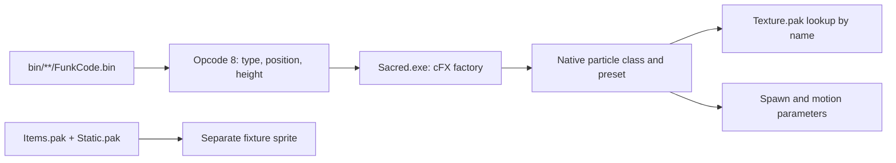

# Particle definitions in Sacred Gold

**Runtime continuation:** [Offsets, motion and color](runtime-motion-color.md)
documents the recovered camera projection, random half-ranges, wind, emission
selection, serialized RGBA tables and blend behavior now used by the remake.
It corrects the earlier width interpretation and supersedes the color/draw
limitations recorded in the original investigation below.

The sampled effects are **independent objects placed by compiled scripts**, with
their particle presets implemented in **Sacred.exe**. The fixture's Items.pak
record does not supply the missing flame/spark emitter definition.

The decisive result is spatial: all **27 strong fixture matches** in the eight
sample scenes have a literal FX creation at exactly the same tile. The eight
provisional fissure observations have lava-smoke creations within two tiles
(one also matches exactly). Their individual fixture ownership remains ambiguous.
See the generated [35-row match table](reports/sample-matches.md) and
[raw commands and nearby candidates](reports/sample-matches.json).

## Embedded runtime catalogue

[`Sacred.Particles.Reader`](../../../Sacred.Particles.Reader/README.md) now reads
the on-disk executable entirely offline and generates C# definitions compiled
into `Sacred.Particles`. `SacredParticleCatalogue.LoadEmbedded()` loads those
definitions without accessing `Sacred.exe` or evaluating instructions at runtime.
Ordinary builds need no game installation. The older Python tools and process
capture below remain independent research/validation tools, not game dependencies.

The complete native name table contains 5,624 rows at VA `0x8EC328`, each `0x44`
bytes: a UInt32 **stored type ID** at `+0`, followed by a 64-byte NUL-terminated
name at `+4`. The native lookup at `0x43CEC4` returns that stored ID. IDs have
gaps; a table index or constant row-index adjustment is not a general ID mapping.
Reading actual IDs yields **210 `TYPE_FX_` catalogue entries**. Fourteen have
decoded smoke/dwarf-magic definitions at all three quality settings; 195 have
unmapped families and one geyser initializer remains incomplete.

The loader also permits offline code recovery. Its encoded header is `0x374`
bytes at VA `0x1D6D380`: the first word is the initial header key, and each later
word is XORed with the preceding encoded word. In the decoded header, `+0x2C`
is the original entry point, `+0x30` the code address, `+0x34` the code byte length,
and `+0x38` the initial code XOR key. Code words use the same rolling operation.
For this executable the decoded range is VA `0x401000`, length `0x48F000`.
Its verified code bytes match the independently captured native module exactly.
No process launch or patched executable is needed for preprocessing.

## Where the data lives



Character, multiplayer and Addon script sets contain these commands. `bin/sgf.bin`
is the selected function-script cache. In this installation it is byte-identical
to `bin/TYPE_NPC_VAMPIRELADY/FunkCode.bin`, so that original file is the report's
source. Do not combine all character/Addon files into a live scene: they contain
duplicates and conditional script code. The reader enumerates instructions; it
does not execute a script VM or establish which functions have run in a save.

The batch program inventoried all 577 installed files and walked all 41
`FunkCode.bin`, `StartCode.bin` and `sgf.bin` files to their exact ends:
2,328,316 instructions, 21 distinct file contents. Deduplicating identical script
contents leaves 51,299 supported literal FX creation instructions. The selected
script has 125,060 instructions, 6,779 object creations, 4,658 fully supported
literal creations and 4,650 of those classified as FX by the existing type-name
catalogue. Unsupported creations are counted with diagnostics, not silently
treated as placements. [Scan summary](reports/script-summary.json).

This is not a claim that every installed archive or every effect family has been
decoded. Existing sample evidence covers the fixture Items/Static/Mixed/Texture
records and nearby world data. The executable's create path resolves the missing
link. Quest containers were also structurally inspected; some are one-byte empty
placeholders and are outside the strict function/start reader's supported scope.

## Compiled instruction bytes

There is no global header in the scanned function/start files. Each command starts
with two little-endian UInt16 values: opcode at `+0`, **inclusive byte length** at
`+2`. Advance by this declared length, not by searching for a byte pattern.
Opcode `0x0008` creates an object. The following recovered operands are tagged:

| Tag | Representation, including tag | Meaning / native decoder |
| --- | --- | --- |
| `01` | tag + NUL-terminated byte string | Name, variable length; `0x472C4D` |
| `02` | tag + UInt32 | Type identifier; `0x473A27` |
| `04` | tag + three Int32 values | Literal tile position; `0x474703` |
| `20` | tag + three Int32 values | Precise world position; `0x474065` |
| `7E` | tag + **Int16** + two unknown/ignored bytes | Signed height offset; `0x473A86` |

`04` with first coordinate `-2` enters a different symbolic representation at
`0x474181`. The literal reader rejects it. The third coordinate is retained as
`Z`; its complete surface/elevation semantics remain unresolved. It is distinct
from the `7E` height. The height decoder sign-extends a **word**, then advances
five bytes: treating its payload as Int32 is incorrect. `NON_UNIQUE` is the
native name sentinel for unbound creations; its fixed length is not a format rule.

For the large coalpot flame, the command at `0x307C68` (decimal 3,177,576) is:

```text
08 00 34 00
01 4e 4f 4e 5f 55 4e 49 51 55 45 00
02 74 03 00 00
04 d4 08 00 00 41 0c 00 00 00 00 00 00
20 dc d9 01 00 b7 91 02 00 00 00 00 00
7e 1a 00 00 00
```

This decodes to type 884, tile `(2260,3137,0)`, precise position
`(121308,168375,0)`, height **26**. Other sampled coalpots use type 886 with
heights 24/25. Thus the same fixture item can have a different independently
authored effect. The previous same-item screenshot discrepancy has a direct
script-level explanation, beyond particle age alone.

The executable's world-coordinate conversion constant at `0x890DC0` is
`53.66563034057617` native units per tile. Preserve both stored coordinate operands;
rounding tile coordinates cannot reconstruct the precise authored position.
At `0x489003..0x489077`, the cFX create path applies the precise coordinates and
separate signed height to the object's transform.

## Native presets and textures

Opcode 8 dispatches through the cFX constructor/factory (`0x5A0A10`, `0x5A0C50`).
A second dispatch constructs an event with a class-local preset number. The
native extractors follow the executable's dispatch paths; they do not infer
presets from fixture names. The production preprocessor covers every FX type in
the name table, including those absent from the selected script.

| Sample effect | Type ID | Native class | Preset | Texture selected by native draw code |
| --- | ---: | --- | ---: | --- |
| Large coalpot fire | 884 | `cParticleSystem_smoke` | 12 | `PARTICLE_FIRE03.TGA` |
| Small coalpot / sconce fire | 886 | `cParticleSystem_smoke` | 10 | `PARTICLE_FIRE03.TGA` |
| Dungeon brazier fire/smoke | 813 | `cParticleSystem_smoke` | 5 | `PARTICLE_FIRE03.TGA` |
| Large lava smoke | 881 | `cParticleSystem_smoke` | 9 | `PARTICLE_SMOKE03.TGA` |
| Medium lava smoke | 882 | `cParticleSystem_smoke` | 8 | `PARTICLE_SMOKE03.TGA` |
| Blue lamp glints | 833 | `cParticleSystem_dwarfmagic` | 2 | `PARTICLE_SPARK04.TGA` |
| Magic fire | 904 | `cParticleSystem_smoke` | 13 | `PARTICLE_MULTI02.TGA` |

These numeric IDs are evidence, not hardcoded rules added to Sacred.*. Texture
names above come from constructor lookups followed by the draw switch, not from
a visual resemblance in the texture gallery. The smoke constructor also loads
water/multi textures for other presets. The renderer's raw flags are retained in
the report; their complete blend/atlas semantics have not been mapped here.

The first Python extraction incorrectly reported magic fire as preset 2. The
creation dispatch starts at `0x48905B` and checks ranges before indexing tables;
its first table only covers types `0x300..0x37B`. Directly indexing it for type
904 read past that table. Both extractors now follow the bounds/branches, and
the regenerated report correctly records preset 13 and `PARTICLE_MULTI02.TGA`.
Constructor texture tracking also preserves the result of each lookup until
its handle is stored: the compiler sometimes pushes the next name first.

The initializer writes spawn blocks of `0x64` bytes and motion blocks of `0x20`
bytes. The layouts map initial size/variation, gravity/variation, velocity,
position offset/variation, rotation, angular velocity, emission interval, count
mode, variant selection and the motion/fade rates. The random widths are centered
around their base values. Some packed-color behavior and trailing bytes remain
explicitly unknown. A particle's fade counter starts at 255; nonpositive fade or
size retires it. An independent authored lifetime field has not been found.

Examples extracted by running the **original initializer machine code**, quality
setting 2:

| Preset | Initial scalar sizes, slots 0 / 1 | Spawn interval | Other significant parameter |
| --- | --- | --- | --- |
| Fire small (10) | 0.5 / 1.0 | 0.02 | Position random widths `(3.5,1,0)` |
| Fire large (12) | 1.0 / 3.0 | 0.02 | Position random widths `(9,0,0)` |
| Fire/smoke medium (5) | 0.75 / 2.0 | 0.02 | Different growth and fade rates from fire-only presets |
| Lava smoke medium (8) | 1.0 / unused | 0.03 | Position random widths `(5,0,0)` |
| Lava smoke large (9) | 1.5 / unused | 0.03 | Position random widths `(20,0,0)` |
| Blue dwarf magic (2) | 2.0 / absent | 0.2 | **Position offset `(0,0,100)`**, random widths `(15,15,15)` |

Size is a native scalar, not screenshot pixels. Intervals/rates use the native
simulation time unit; this investigation has not independently traced its clock
conversion to seconds. Slot selection and quality affect actual output density;
do not add per-slot rates to infer total particles per second. In the blue preset,
the 100-unit internal offset explains why a script height of zero still produces
raised glints.

[native-presets.json](reports/native-presets.json) contains the full extracted
values, named texture lookups, dispatch addresses, and raw draw flags. Fourteen
type dispatches across the two mapped classes return successfully. The unrelated
geyser initializer reaches an external CRT/random call and is explicitly marked
incomplete. Twenty-one other FX types discovered in the selected script belong
to unimplemented families and are listed separately; the full embedded catalogue
has 195 such entries. All sample families are covered.

## Added code and boundaries

* `Sacred.Core/GameBin/Scripts`: instruction and tagged operand layouts, raw
  commands and decoded literal creations. Unknown operand bytes remain available.
* `Sacred.Assets/GameBin/SacredCompiledScriptReader.cs`: strict command boundaries.
* `Sacred.Assets/GameBin/SacredScriptCreateObjectReader.cs`: supported literal
  creation arguments; rejects unsupported/symbolic operands as a whole.
* `Sacred.Core/Particles`: shared emission/motion blocks and smoke/dwarf-magic
  native object and serialized-state layouts, with unmapped gaps preserved.
* `Sacred.Core/Executable`: stored ID/name rows and recovered decoded loader-header
  fields. Unmapped header bytes remain gaps in the explicit layout.
* `Sacred.Particles.Reader`: offline PE/code decoding, bounded initializer
  evaluation and deterministic C# generation for all three quality settings.
* `Sacred.Particles`: embedded catalogue, typed definitions, texture bindings,
  native draw arguments and parameter sets, without a runtime reader dependency.
* `Sacred.Core.Analyzer`: registers the recovered script/executable layouts and preserves
  unknown bytes inside nested layouts when calculating coverage.

The smoke serializer at `0x76E7D0` writes a UInt32 length `0xD9C`, then that many
bytes from object `+0x20A0`, then `0xDEADC0DE`, then base-system state. Its texture
handles start at `+0x2E3C` and are outside the serialized block. Dwarf magic writes
`0x48C` bytes from `+0x20A0` at `0x78A420`, with the same framing. Their enclosing
save-file component/offset remains unknown: these are proven serialized blocks,
not a claimed new .pak format. The larger system layouts describe native 32-bit
memory objects, not managed objects or fixture descriptors.

The research tool writes JSON/Markdown outside Sacred.*. The preprocessor accepts
the original executable and emits C# compiled into `Sacred.Particles`; runtime
code does not depend on a generated research file or custom data format. Rendering
integration still needs script execution/state selection and the native draw
semantics; attaching emitters in AssetManager by fixture texture/color would
discard the independent placement and preset information recovered here.

## Run the batch investigation

From the repository root in PowerShell:

```powershell
& 'C:\Users\Aytac\.dotnet\dotnet.exe' run --project docs/research/particle-definitions/ParticleResearch -- `
  'E:\SteamLibrary\steamapps\common\Sacred Gold' `
  docs/research/particle-emitter-samples _scratch/particle-report
```

An optional fourth argument selects another relative function/start script path
for sample matching. Outputs include every decoded literal FX command, raw bytes,
script hashes/aliases, unsupported-operand counts, a complete file inventory and
all sample matches. Existing type-name catalogue slots are checked byte-for-byte
against the supplied Sacred.exe before matching. This earlier research program
inherits the ID/name association from that catalogue; slot verification alone
does not rediscover it. The new preprocessor reads each row's stored ID directly,
and the reader checks resolve all 35 sampled commands against its embedded data.

The full 20 MB command export stays in `_scratch`; the small reproducible summary,
matches and native results are retained in `reports/`. No screenshot capture or
per-image model analysis is required by these tools.

```powershell
py -m pip install -r docs/research/particle-definitions/requirements.txt
py docs/research/particle-definitions/native_presets.py `
  --memory-image _scratch/particle-current-memory.bin `
  --script-summary _scratch/particle-report/script-summary.json `
  --output _scratch/particle-report/native-presets.json
py docs/research/particle-definitions/native_evidence.py `
  --memory-image _scratch/particle-current-memory.bin `
  --output _scratch/particle-report/native-evidence.md
```

The older Python tools expect an unpacked module dump, not a PE-file offset
substituted for a virtual address. The C# preprocessor above handles the on-disk
encoding itself. For independent validation, the reusable
`CaptureMemory` project below starts its own hidden Sacred process, waits for
initialization, reads the module and terminates only the process it started:

```powershell
& 'C:\Users\Aytac\.dotnet\dotnet.exe' run --project docs/research/particle-definitions/CaptureMemory -- `
  'E:\SteamLibrary\steamapps\common\Sacred Gold\Sacred.exe' _scratch/particle-current-memory.bin
```

The extractors reject an unrecognized unpacked `.text` hash. Evaluation supplies
an empty particle vector and reports only bytes actually written by initialization;
unwritten fields stay null. Unexpected reads of uninitialized object fields,
external calls, and instruction-budget exhaustion mark the result incomplete.
Constructor texture lookups and draw selection are traced, but a complete
constructor, simulation or renderer is not executed.

## Evidence and validation

On-disk Sacred.exe SHA-256:
`4df6659352282a0e57bdf69d2ac33396200fd0b54670d327cb9822ffdc4891cd`.
Unpacked `.text` (RVA `[0x1000,0x48FA32)`, base `0x400000`) SHA-256:
`ee60108ce8147721717df1632c47b89c2b445a0255922219fa14a5980feadf37`.
A fresh process dump matched the earlier research dump's code bytes exactly.
Offline rolling-XOR decoding also produces those exact code bytes.
The full memory image is not included in this report.

[Focused disassembly](reports/native-evidence.md) supports the operand decoding,
factories, texture lookups, serialization and motion/generator mappings. The
scripts' exact offsets, raw bytes and hashes are retained in the generated reports.

The batch program runs 27 verification checks: real captured-command decoding,
layout sizes, signed height with a nonzero ignored upper word, variable names and
operand ordering, omitted positions, preservation of unknown opcodes, malformed
instruction boundaries, unknown operands and symbolic positions. Run these alone:

```powershell
& 'C:\Users\Aytac\.dotnet\dotnet.exe' run --project docs/research/particle-definitions/ParticleResearch -- --self-test
```

Sacred.Assets and its Core dependency build successfully. The native extractor
completed every sampled preset without unexpected object-state reads.

The [reader checks](ParticleReaderChecks/CatalogueChecks.cs) passed **2,536
checks** with the original executable, including all **81 parameter sets
byte-for-byte** against independently evaluated native initializers (27 sets per
quality). They also verify fresh preprocessing against embedded metadata/data,
malformed executables, cancellation, unsupported definitions, and all 35 sample
commands. The compact [native reference](reports/reader-native-reference.json)
is generated with Unicorn, independently of the managed C# instruction evaluator:

```powershell
py docs/research/particle-definitions/native_reference.py `
  --memory-image _scratch/particle-current-memory.bin `
  --output docs/research/particle-definitions/reports/reader-native-reference.json
& 'C:\Users\Aytac\.dotnet\dotnet.exe' run --project docs/research/particle-definitions/ParticleReaderChecks -- `
  docs/research/particle-definitions/reports/reader-native-reference.json `
  'E:\SteamLibrary\steamapps\common\Sacred Gold\Sacred.exe'
```

The generated-source `--check` passed, `Sacred.Engine` builds with the runtime
catalogue, and a standalone Native AOT application referencing only
`Sacred.Particles` successfully loads all three embedded qualities.
